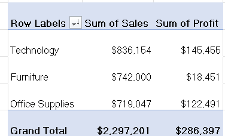
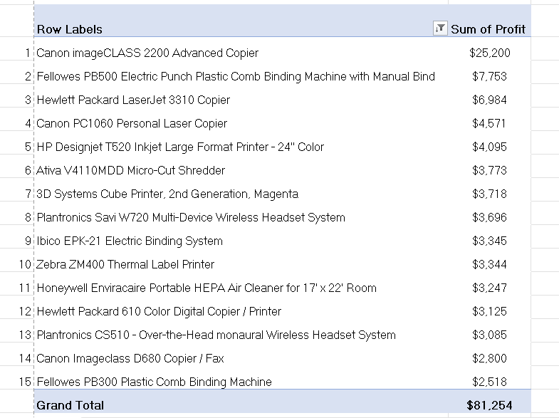
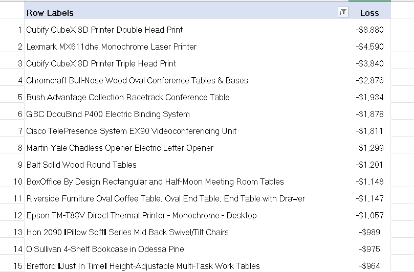

# 01 - 	Pivot Tables
## Dataset

### Tableau Sample Superstore Dataset

- Source: Kaggle
- Original Dataset: https://www.kaggle.com/datasets/truongdai/tableau-sample-superstore
- License: Check the Kaggle dataset license before redistribution.

## Task 1 – Regional Sales Performance

**Business Question**  
Which region generates the highest sales?

**Answer**  

*West Region generates highest sales.*

**Reflection**  
This task helped me understand how Pivot Tables summarize data by categories.

## Task 2 – Top Performming States

**Business Question**  
Which 10 states generated the highest revenue?

**Answer**  

The top 10 states generated highest revenue are:

*California, New York, Texas, Washington, Pennsylvania, Florida, Illinois, Ohio, Michigan and Virginia*

**Reflection**  
This task helped me understand Filtering and Sorting data in Pivot Tables.

## Task 3 – Product Category Analysis

**Business Question**  
Which product category contributes the most revenue?

**Answer**  

*Products with Technology category contributed the most revenue and also Profit.*

**Reflection**  
This task helped me understand Top/Bottom analysis.

## Task 4 – Most Profitable Products

**Business Question**  
Which 15 products earn the highest profit?

**Answer**  

The 15 products with highest profit are shown in the screenshot.

**Reflection**  
This task helped me understand *Top N analysis* to identify the most valuable products and prioritize them for business decisions.

## Task 5 – Loss Making Products

**Business Question**  
Which products are losing the company money?

**Answer**  

The 15 products with Highest loss are shown in the screenshot.

*There are total 301 loss making products which are creating a total loss of $77,068.*

**Reflection**  
This task helped me to detect negative profitability. I practiced filtering conditions (Profit < 0) and learn how to spot risks in product portfolios.