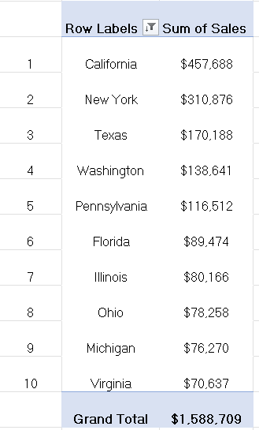

# 01 - 	Pivot Tables
## Dataset

### Tableau Sample Superstore Dataset

- Source: Kaggle
- Original Dataset: https://www.kaggle.com/datasets/truongdai/tableau-sample-superstore
- License: Check the Kaggle dataset license before redistribution.

## Task 1 – Regional Sales Performance

**Business Question**  
Which region generates the highest sales?

**Answer**  

*West Region generates highest sales.*

**Reflection**  
This task helped me understand how Pivot Tables summarize data by categories.

## Task 2 – Top Performming States

**Business Question**  
Which 10 states generated the highest revenue?

**Answer**  

The top 10 states generated highest revenue are:

*California, New York, Texas, Washington, Pennsylvania, Florida, Illinois, Ohio, Michigan and Virginia*

**Reflection**  
This task helped me understand Filtering and Sorting data in Pivot Tables.