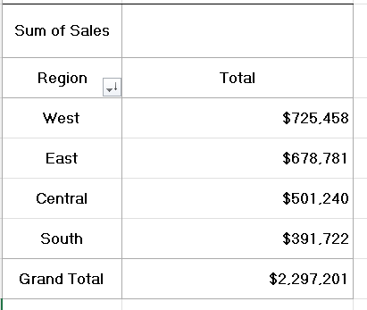

# 01 - 	Pivot Tables
## Dataset

### Tableau Sample Superstore Dataset

- Source: Kaggle
- Original Dataset: https://www.kaggle.com/datasets/truongdai/tableau-sample-superstore
- License: Check the Kaggle dataset license before redistribution.

## Task 1 – Regional Sales Performance

**Business Question**  
Which region generates the highest sales?

**Answer**  

*/West Region generates highest sales./*

**Reflection**  
This task helped me understand how Pivot Tables summarize data by categories.
