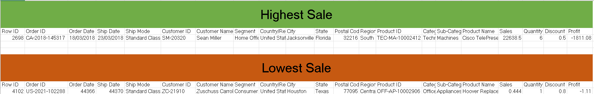
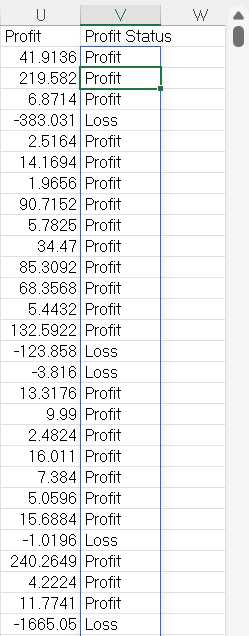
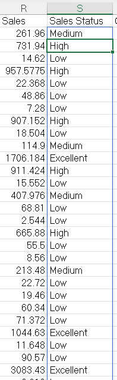
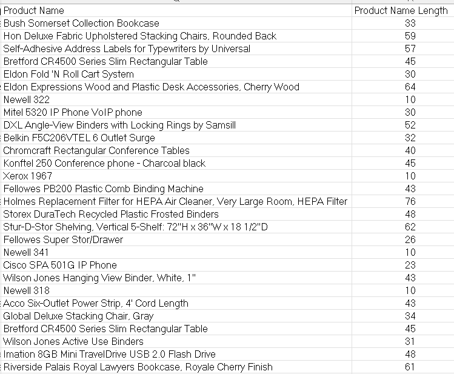

# 02 - 	Formulas
## Dataset

### Tableau Sample Superstore Dataset

- Source: Kaggle
- Original Dataset: https://www.kaggle.com/datasets/truongdai/tableau-sample-superstore
- License: Check the Kaggle dataset license before redistribution.

## Task 1 – Highest and Lowest Sales

**Business Question**  
Which order generated the highest sales and which generated the lowest sales?

**Answer**  

*Order ID CA-2018-145317 generated **highest sale of $22638.48** and Order ID US-2021-102288 generated **lowest sale of $0.444.***

**Reflection**  
This task helped me understand quickly identify extreme values for reporting.

## Task 2 – Profit Classification

**Business Question**  
Classify every order based on its profit.

**Answer**  

**Reflection**  
This task helped me how simple logic functions can classify outcomes.

## Task 3 – Sales Performance Rating

**Business Question**  
Categorize every order based on Sales.

**Answer**  

**Reflection**  
This task helped me to undertsand how to segment sales into meaningful ranges.

## Task 4 – Product Name Analysis

**Business Question**  
How many characters are in each product name?

**Answer**  

**Reflection**  
This task helped me to undertsand how text functions help validate data quality.
