# 02 - 	Formulas
## Dataset

### Tableau Sample Superstore Dataset

- Source: Kaggle
- Original Dataset: https://www.kaggle.com/datasets/truongdai/tableau-sample-superstore
- License: Check the Kaggle dataset license before redistribution.

## Task 1 – Highest and Lowest Sales

**Business Question**  
Which order generated the highest sales and which generated the lowest sales?

**Answer**  

*Order ID CA-2018-145317 generated **highest sale of $22638.48** and Order ID US-2021-102288 generated **lowest sale of $0.444.***

**Reflection**  
This task helped me understand quickly identify extreme values for reporting.

## Task 2 – Profit Classification

**Business Question**  
Classify every order based on its profit.

**Answer**  

**Reflection**  
This task helped me how simple logic functions can classify outcomes.

## Task 3 – Sales Performance Rating

**Business Question**  
Categorize every order based on Sales.

**Answer**  

**Reflection**  
This task helped me to undertsand how to segment sales into meaningful ranges.

## Task 4 – Product Name Analysis

**Business Question**  
How many characters are in each product name?

**Answer**  

**Reflection**  
This task helped me to undertsand how text functions help validate data quality.

## Task 5 – Product Code Extraction

**Business Question**  
Extract the first 5 characters of every Order ID and the last 3 characters of every Product Name.

**Answer**  
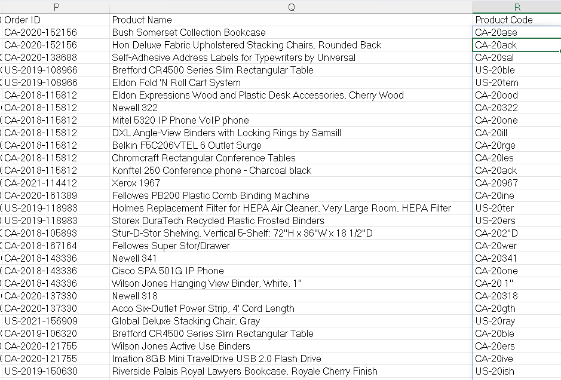

**Reflection**  
This task highlighted how string functions can generate codes.

## Task 6 – Convert Dates for Reports

**Business Question**  
Display Order Date as Month-Year.

**Answer**  
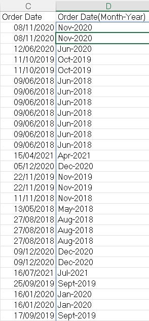

**Reflection**  
I learned how to reformat dates for reporting.

## Task 7 – Customer Name Cleaning

**Business Question**  
Some customer names contain extra spaces. Remove them.

**Answer**  
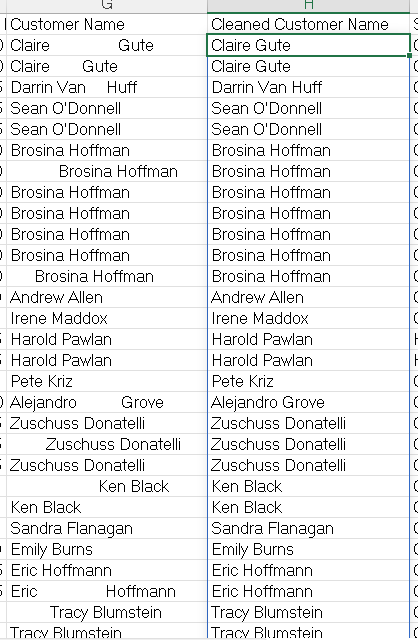

**Reflection**  
This task helped me to understand the importance of data cleaning.

## Task 8 – Customer Label

**Business Question**  
Create a label:
            Customer Name - State
Example:
            Sean Miller - California
**Answer**  
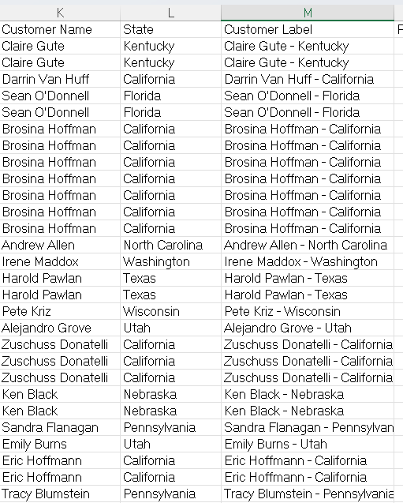

**Reflection**  
This task helped me to understand how concatenation can create meaningful labels.

## Task 9 – Standardize Product Names

**Business Question**  
Replace every occurrence of "Phones" with "Mobile Phones".  

**Answer**  
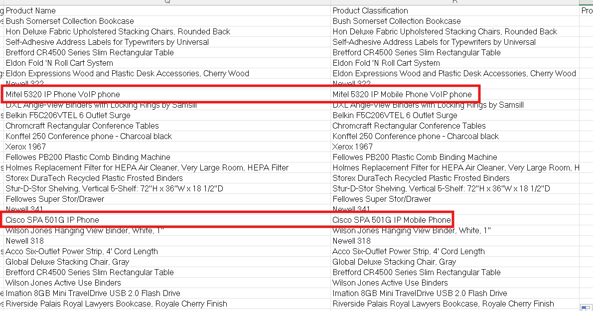

**Reflection**  
This task taught me how to enforce naming consistency.

## Task 10 - Regional Revenue

**Business Question**  
Calculate total Sales for the West region.

**Answer**  
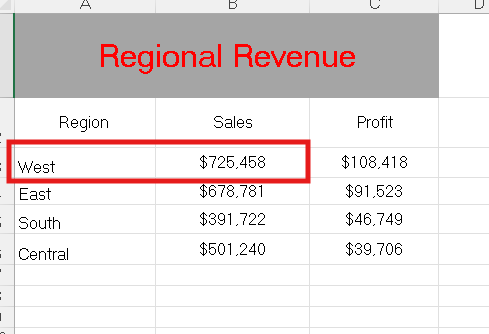

**Reflection**  
This task helped me to understand conditional summation and  how companies track regional performance to allocate resources effectively.

## Task 11 - Technology Revenue

**Business Question**  
Calculate total Sales for the Technology category.

**Answer**  
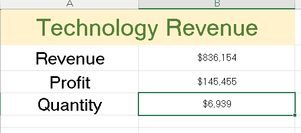

**Reflection**  
This task helped me to isolate category‑specific revenue. Businesses rely on this to identify their strongest product lines. 

## Task 12 - Multicondition Sales

**Business Question**  
Calculate total Sales where:

- Region = West
- Category = Technology

**Answer**  
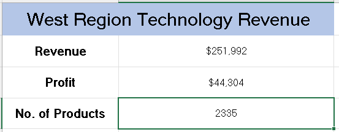

**Reflection**  
This task helped me to apply multiple filters simultaneously. This is critical for targeted analysis, like measuring sales of a product category in a specific region.

## Task 13 - Total Profits

**Business Question**  
Calculate total company profit.

**Answer**  
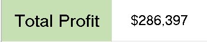

**Reflection**  
This task helped me in the use of aggregation functions. Summing profits provides a quick snapshot of overall business health.

## Task 14 - Number of Orders

**Business Question**  
How many orders are in the dataset?

**Answer**  
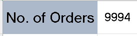

**Reflection**  
This task helped to understand how counting functions measure transaction volume.

## Task 15 - Orders from California

**Business Question**  
Count all orders from California.

**Answer**  
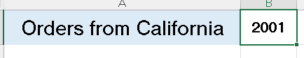

**Reflection**  
This task helped to understand how to filter by location. Regional order counts help companies understand geographic demand patterns.

## Task 16 - Consumer Orders in West Region

**Business Question**  
Count orders where:

- Segment = Consumer
- Region = West

**Answer**  
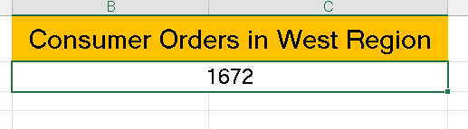

**Reflection**  
This task helped to practice multi‑criteria counting. This is useful for segment‑based analysis.

## Task 17 - Shipping Duration

**Business Question**  
Calculate how many days each shipment took.

**Answer**  
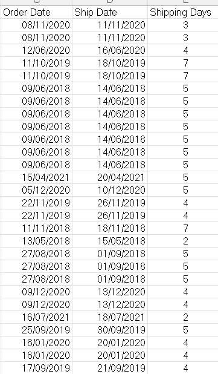

**Reflection**  
This task helped to calculate logistics metrics. Measuring shipping days helps evaluate delivery efficiency and customer satisfaction.

