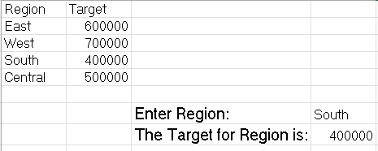
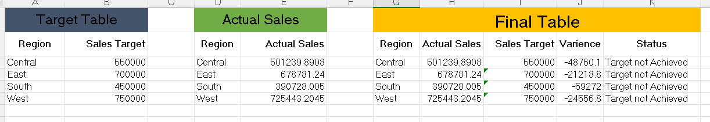
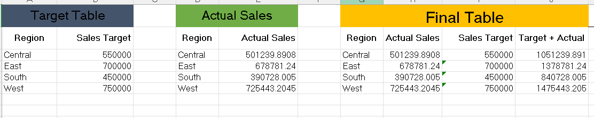
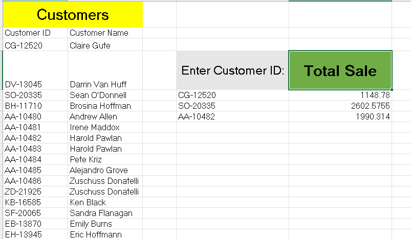
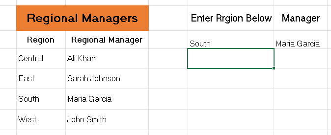
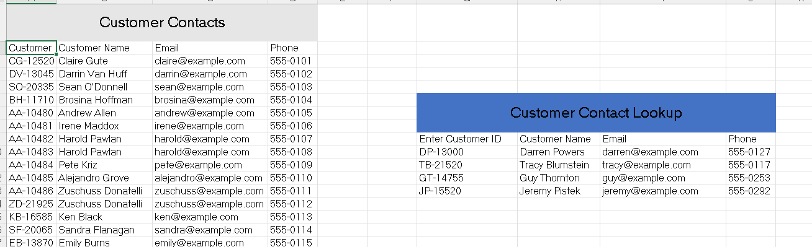
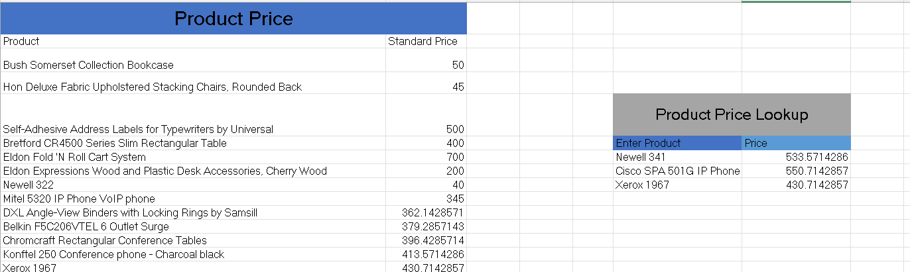
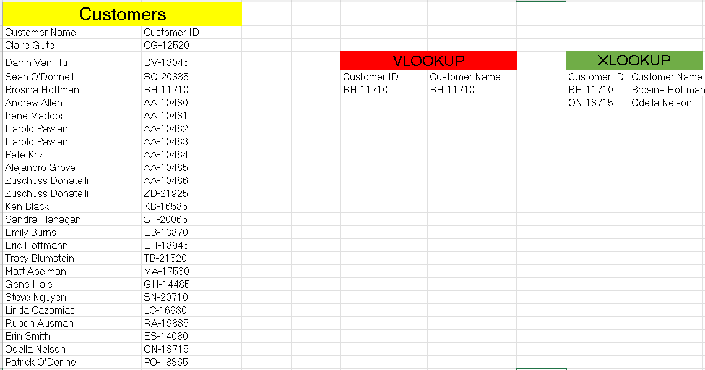

# 02 - 	XLOOKUP
## Dataset

### Tableau Sample Superstore Dataset

- Source: Kaggle
- Original Dataset: https://www.kaggle.com/datasets/truongdai/tableau-sample-superstore
- License: Check the Kaggle dataset license before redistribution.

## Task 1 – XLOOKUP Overview

**Business Question**  
Find the customer name for a given Order ID.

**Answer**  

**Reflection**  
This task helped me to understand how to quickly retrieve customer names from Order IDs, which is essential for customer service lookups.

## Task 2 – Product Information Lookup

**Business Question**  
A salesperson enters a Product Name. Return its Category and Sub-Category.

**Answer**  

**Reflection**  
I practiced returning multiple fields (Category, Sub-Category) at once, useful for product classification.

## Task 3 – Customer Profile

**Business Question**  
HR wants to know the customer's Segment and Region using Customer ID.

Return:

- Customer Name
- Segment
- Region

**Answer**  

**Reflection**  
I learned how XLOOKUP can pull full customer details, strengthening segmentation analysis.

## Task 4 – Exact Match

**Business Question**  
A manager accidentally types:

*Californi*
instead of
*California*

Your formula should not return an incorrect value.

**Answer**  

**Reflection**  
I understood the importance of exact matches to avoid wrong results when data entry errors occur.

## Task 5 – Search Order (Latest Order)

**Business Question**  
One customer has placed many orders.

Management wants to know:

*What was the customer's most recent order?*

**Answer**  

**Reflection**  
I learned to search backwards to find the most recent order, key for tracking customer activity.

## Task 6 – First Order (First Order)

**Business Question**  
One customer has placed many orders.

Management wants to know:

*What was the customer's most first order?*

**Answer**  

**Reflection**  
I practiced searching forward to identify first purchases, useful for onboarding analysis.

## Task 7 – Horizontal Lookup

**Business Question**  
Return Sales for all months in a row.

**Answer**  

**Reflection**  
This task helped me to discover XLOOKUP that works across rows, making monthly KPI retrieval easier.

## Task 8 – Regional Revenue

**Business Question**  
Managers have regional sales targets.
Use XLOOKUP to return the target for a selected region.

**Answer**  

**Reflection**  
I applied XLOOKUP to fetch regional targets, aligning sales with management goals.

## Task 9 – Regional Performance

**Business Question**  
Compare:

Actual Sales
vs
Target Sales

Calculate:

Variance = Actual − Target

**Answer**  

**Reflection**  
This task helped me to combine lookup with arithmetic to calculate variance, vital for performance monitoring.

## Task 10 – Sales + Target

**Business Question**  
For a selected region, calculate:

Actual Sales
+
Target

**Answer**  

**Reflection**  
This task helped me to nest XLOOKUP in formulas, showing how to build flexible reporting metrics.

## Task 11 – XLOOKUP with SUM

**Business Question**  

The CEO wants total sales for a selected customer.

If a customer has multiple orders, use a lookup to identify the customer or category and then aggregate the relevant sales (or use XLOOKUP to retrieve criteria from a helper table and combine it with SUMIF/SUMIFS).

**Answer**  

**Reflection**  
This task helped me to nest XLOOKUP in formulas, showing how to build flexible reporting metrics.

## Task 12 – Regional Manager Lookup

**Business Question**  

The Sales Director wants to know:

*Who is responsible for each sales region?*

Return the Regional Manager based on Region.

**Answer**  

**Reflection**  
This task helped me to understand regions to managers, reinforcing relational data thinking.

## Task 13 – Customer Contact Lookup

**Business Question**  
Create a customer table:

| Customer ID | Name |Phone | Email |

Return:

- Customer Name
- Phone
- Email

using Customer ID.

**Answer**  

**Reflection**  
This task helped me to retrieve multiple contact details from one ID, simulating Customer Relationship Management functionality.

## Task 14 – Product Price Lookup

**Business Question**  
Create:

| Product | Standard Price |

Return product price from the price list.

**Answer**  

**Reflection**  
This task helped me to replace manual searches with automated lookups, streamlining pricing analysis.

## Task 15 – XLOOKUP vs VLOOKUP

**Business Question**  

Find the Customer Name using Customer ID.

Solve it with:

- XLOOKUP
- VLOOKUP

**Answer**  

**Reflection**  
This task helped me to compare both functions and saw XLOOKUP’s flexibility in looking left without rearranging data

