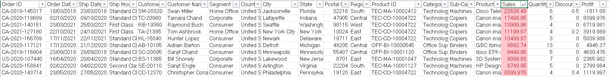
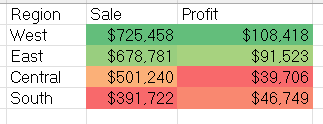
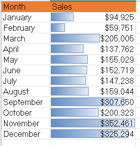
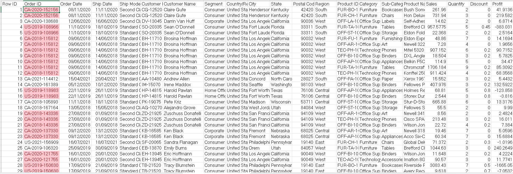

# 04 - 	Conditional Formatting

## Dataset

### Tableau Sample Superstore Dataset

- Source: Kaggle
- Original Dataset: https://www.kaggle.com/datasets/truongdai/tableau-sample-superstore
- License: Check the Kaggle dataset license before redistribution.

## Task 1 – Top Revenue Orders

**Business Question**  
Which orders generated the highest sales?

**Answer**  

**Reflection**  
I learned how to highlight the top 10 sales orders, which makes it easy for managers to spot high‑value transactions without scanning the entire dataset.

## Task 2 – Loss-Making Orders

**Business Question**  
Which orders are losing money?

**Answer**  
.png)
.png)

**Reflection**  
This task helped me to understand how conditional formatting can act as a red‑flag system for financial losses.

## Task 3 - High Discount Alert

**Business Question**  
Which orders have unusually high discounts greater than 30%?

**Answer**  
.png)
.png)

**Reflection**  
This task  can erode profitability by highlighting discounts above 30% them visually helps analysts and managers monitor pricing risks in real time.

## Task 4 - Regional Performance Heat Map

**Business Question**  
Which regions generate the highest sales?

**Answer**  

*West and East Regions have highest Sales.*

**Reflection**  
This task showed me how to compare regions at a glance. It emphasized the value of visual cues in spotting strong and weak markets.

## Task 5 - Monthly Sales Trend

**Business Question**  
Which months perform best?

**Answer**  

*November and December have highest Sales.*

**Reflection**  
This task helped me visualize monthly performance directly in the table using data bars. This taught me how conditional formatting can replace charts for quick trend analysis.

## Task 6 - Profit Margin Categories

**Business Question**  
Which products are highly profitable?
- Profit > 500 → Green
- 0–500 → Yellow
- <0 → Red

**Answer**  
.png)
.png)

**Reflection**  
This task helped me to create multiple rules (green/yellow/red) showed me how to categorize profitability. This reinforced how formatting can guide decision‑making on product priorities.

## Task 7 - Duplicate Order IDs

**Business Question**  
Are there duplicate Order IDs?

**Answer**  

*Yes, there are many duplicate order IDs.*

**Reflection**  
This task helped me to detect duplicates improved my understanding of data quality checks. 