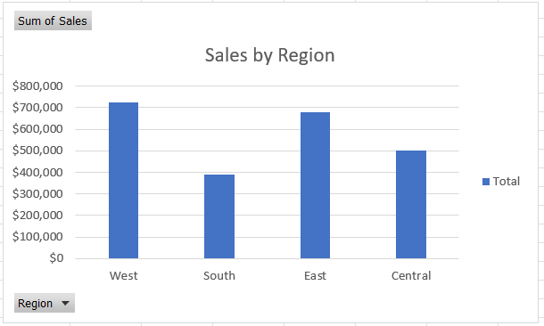
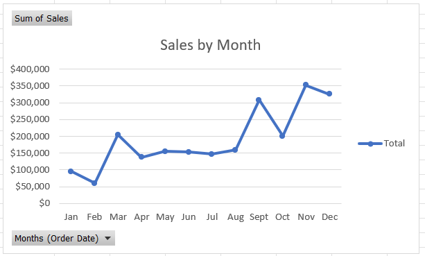
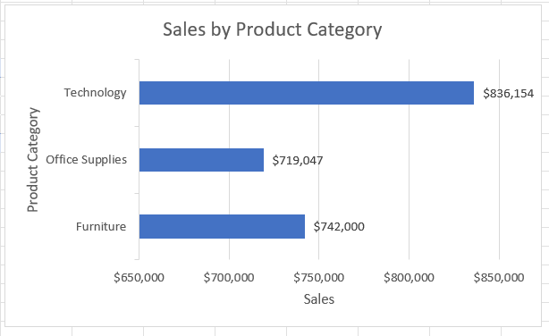
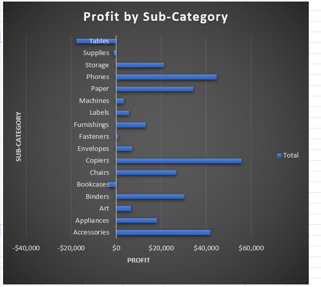
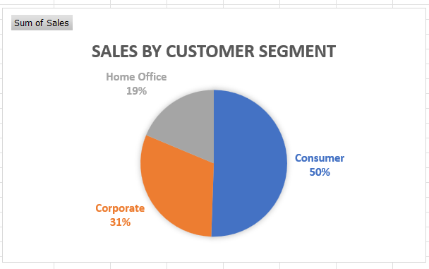
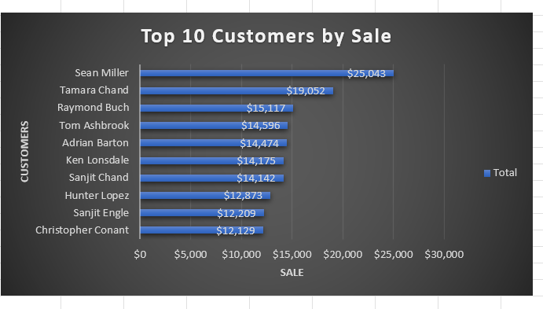
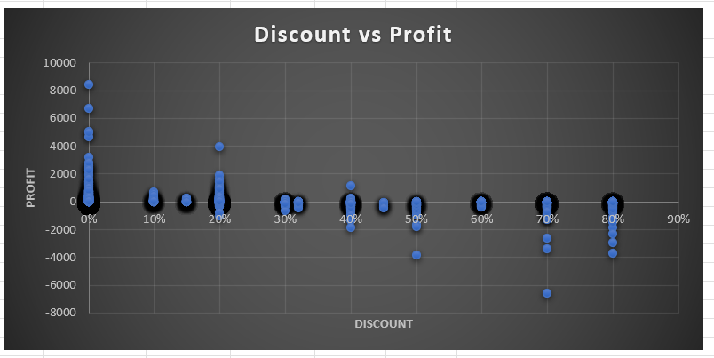

# 05 - 	Charts

## Dataset

### Tableau Sample Superstore Dataset

- Source: Kaggle
- Original Dataset: https://www.kaggle.com/datasets/truongdai/tableau-sample-superstore
- License: Check the Kaggle dataset license before redistribution.

## Task 1 – Regional Sales Comparison

**Business Question**  
Which region generates the highest sales?

**Answer**  

*West Region* generates highest sales.

**Reflection**  
I learned how to use clustered column charts to compare regions. This showed me how visual comparisons can quickly highlight the strongest markets for investment.

## Task 2 – Monthly Sales Trend

**Business Question**  
How have sales changed over time?

**Answer**  

**Reflection**  
Creating line charts taught me how to identify seasonality and growth patterns. It reinforced the importance of time‑series analysis in forecasting.

## Task 3 – Sales by Product Category

**Business Question**  
Which product category contributes the most revenue?

**Answer**  

*Technology* category contributes most revenue.

**Reflection**  
Bar charts helped me compare categories side by side. This showed me how to identify the company’s strongest product line and prioritize resources.

## Task 4 – Profit by Sub-Category

**Business Question**  
Which sub-categories generate the most profit?

**Answer**  

The sub-category of *copiers* generates most profit.

**Reflection**  
Ranking sub‑categories by profit taught me how to prioritize profitable groups. It highlighted the value of sorting and labeling for clear storytelling.

## Task 5 – Sales by Customer Segment

**Business Question**  
How is revenue distributed across customer segments?

**Answer**  

- Consumer Segment holds 50% revenue.
- Corporate Segment holds 31% revenue.
- Home Office Segment holds 19% revenue.

**Reflection**  
Pie charts helped me visualize customer composition. This taught me how to communicate part‑to‑whole relationships in a simple way.

## Task 6 – Top 10 Customers

**Business Question**  
Who are the highest-value customers?
- Create a Horizontal Bar Chart of the Top 10 customers by sales.

**Answer**  

**Reflection**  
Highlighting VIP customers with bar charts showed me how to focus on loyalty programs. It reinforced the importance of ranking in customer analysis.

## Task 7 – Discount vs Profit Relationship

**Business Question**  
Do higher discounts reduce profit?

**Answer**  

*Yes*, higher discounts reduce profit.

**Reflection**  
Scatter plots revealed the correlation between discounts and profit. This taught me how to investigate pricing risks and profitability trade‑offs.
