# 06 - 	Data Cleaning

## Dataset

### Shopify Orders Dataset

- Source: Kaggle
- Original Dataset: https://www.kaggle.com/datasets/mabdullahkhalil/shpify-orders-dataset
- License: Check the Kaggle dataset license before redistribution.

## Task 1 – Data Quality Assessment

**Business Question**  
Before analyzing sales, what data quality issues exist in the dataset?

**Answer**  
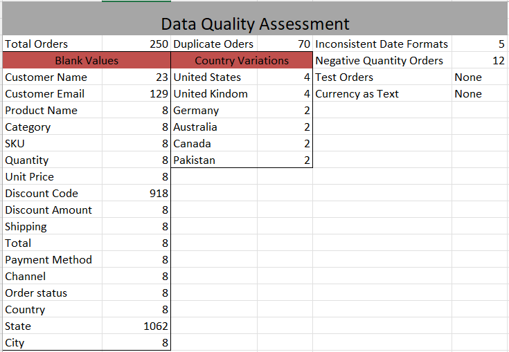

**Reflection**  
Auditing the dataset upfront revealed the scope of issues — duplicates, blanks, mixed formats. I learned that analysts must first measure quality before fixing it, ensuring cleaning is systematic not random.

## Task 2 – Standardize Country Names

**Business Question**  
Can we accurately analyze sales by country?

**Answer**  
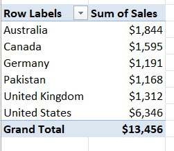

*Yes ,* we can analyze sales by country accurately now.

**Reflection**  
Aligning country names taught me that inconsistent text can fragment geographic analysis. Standardization ensures reliable market insights.

## Task 3 – Evaluate Missing States

**Business Question**  
Are blank State values actually missing data?

**Answer**  
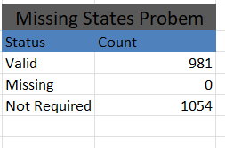

*No ,* they are not missing data. As only US states are mentioned only because each one has different law.

**Reflection**  
Distinguishing between expected blanks (international orders) and missing data (US orders) showed me that cleaning requires judgment, not just formulas.

## Task 4 – Standardize Order Dates

**Business Question**  
Can all orders be analyzed chronologically?

**Answer**  
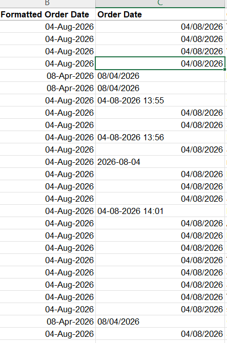

*No ,* they cannot be analyzed chronologically because we have to convert them in a standard format as now converted.

**Reflection**  
I standardized all order dates into a consistent format so that Excel recognizes every value as a valid date. This enables accurate time-based analysis, such as monthly sales trends, seasonal reporting, and year-over-year comparisons.

## Task 5 – Missing Customer Emails

**Business Question**  
Which orders cannot be used for email marketing?

**Answer**  
.png)
.png)

*121 orders* with no Email addresses about 6% of total orders cannot be used for email marketing.

**Reflection**  
Identifying missing emails highlighted how CRM and marketing depend on complete customer records. Analysts must flag gaps that weaken engagement strategies.

## Task 6 – Clean Discount Codes

**Business Question**  
How many discount codes are actually unique?

**Answer**  
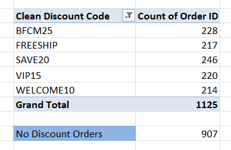

*Total 5* discount codes are actually unique.

**Reflection**  
Standardizing discount codes prevented duplicate coupon reporting. I realized that even small inconsistencies can distort promotional performance metrics.

## Task 7 – Convert Currency Text to Numbers

**Business Question**  
Can financial metrics be calculated correctly?

**Answer**  
.png)
.png)

*Yes, After conversion* they can be used for calculation.

**Reflection**  
Converting currency text into currency numbers enabled accurate financial calculations.

## Task 8 – Remove Test Orders

**Business Question**  
Should test transactions be included in business reports?

**Answer**  

- *No,* test transactions should not be included in business reports.
- And fortuntly, They are not in this dataset.

**Reflection**  
Removing test orders helps to get rid of fake transactions can inflate KPIs. Analysts must filter operational noise before reporting.

## Task 9 – Remove Duplicate Orders  

**Business Question**  
Are duplicate orders inflating revenue?

**Answer**  
<figure>
  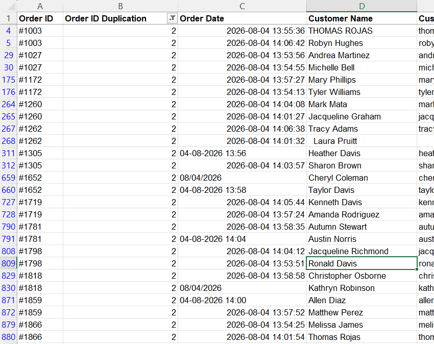
  <figcaption>Figure 1: Before removing duplicate orders</figcaption>
</figure>

<figure>
  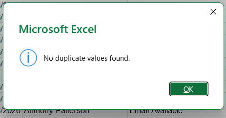
  <figcaption>Figure 2: After removing duplicate orders</figcaption>
</figure>

*Yes, 35 duplicate orders* were inflating revenue which are now removed.

**Reflection**  
Eliminating duplicate orders reinforced that revenue accuracy depends on clean transaction logs. Trust in dashboards starts with trustworthy inputs.

## Task 10 – Validate Quantities

**Business Question**  
Do negative quantities represent returns or errors?

**Answer**  
.png)
*Before Removing negative quantities*

.png)
*After removing negative quantities*

*Yes,* there are data entry errors. Now they are corrected.

**Reflection**  
Negative quantities as errors showed me that analysts must interpret anomalies in business context, not just flag them.

## Task 11 – Validate Total Amount

**Business Question**  
Are order totals calculated correctly?

**Answer**  
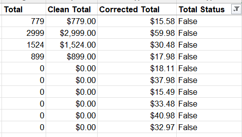

*No,*  10 orders are not calculated correctly. These are now corrected.

**Reflection**  
Recalculating totals revealed mismatches in pricing logic. I learned that analysts safeguard financial credibility by verifying calculations.

## Task 12 – Detect Sales Outliers 

**Business Question**  
Which orders have unusually high totals?

**Answer**  
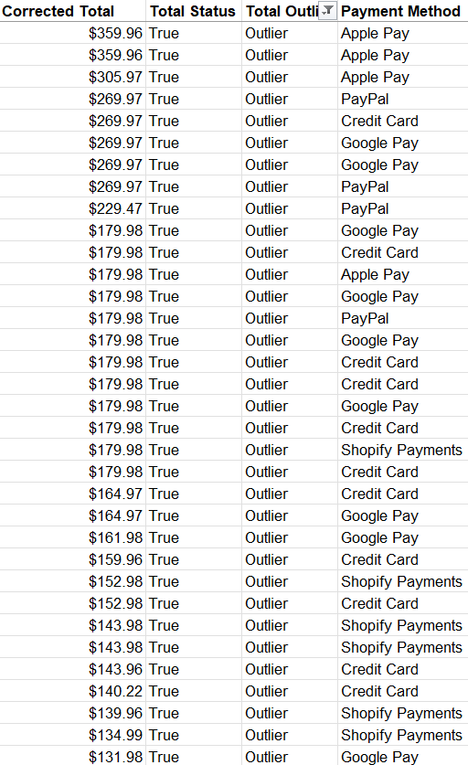

**Reflection**  
- The IQR method flagged order totals above $81.355 as statistical outliers. However, investigation showed that many values between $82 and $359 represented realistic high-value orders rather than data errors.
- Outlier detection is not about removing all flagged values; it’s about interpreting context. In ecommerce, bulk purchases or premium products naturally generate higher totals.

## Task 13 – Validate SKU Consistency 

**Business Question**  
Does every product use a consistent SKU?

**Answer**  
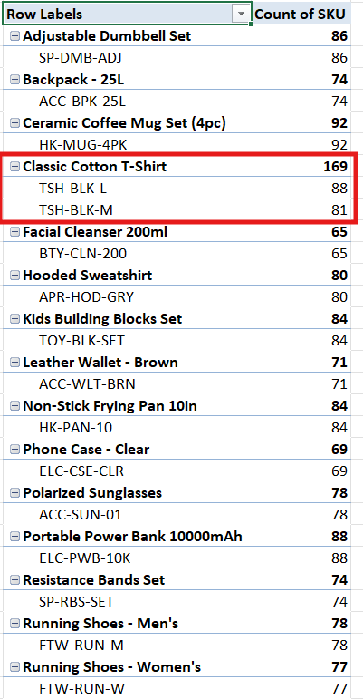

All products *except one* product use a consistent SKU.

**Reflection** 

Checking SKU consistency showed me that catalog integrity underpins inventory and sales analysis. Without it, product-level insights collapse. 

## Task 14 – Create a Data Quality Dashboard 

**Business Question**  
How clean is the Shopify order data?

**Answer**  
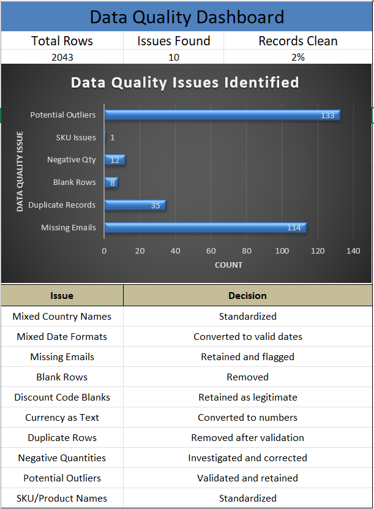

**Reflection** 

Building a dashboard visualized improvements and KPIs. I realized that communicating data quality builds stakeholder trust.

## Task 15 – Clean Dataset Export

**Business Scnerio**  
The analytics team needs a clean dataset for reporting.

**Delivery**  
- A file of dataset after cleaning is exported and saved.

**Reflection**

Delivering a cleaned dataset taught me that the end goal of cleaning is usability. Analysts must produce reliable, ready-to-use data for decision-making.

